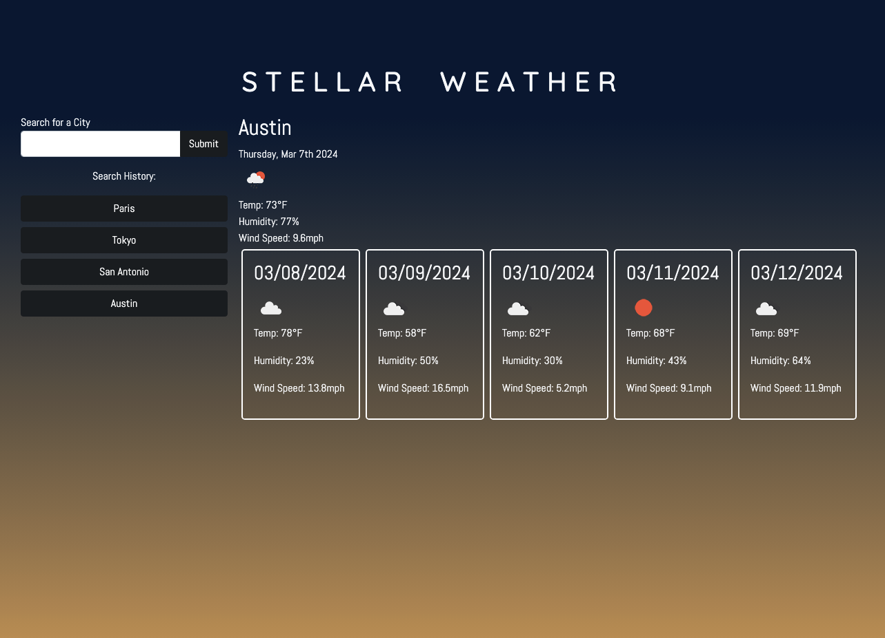
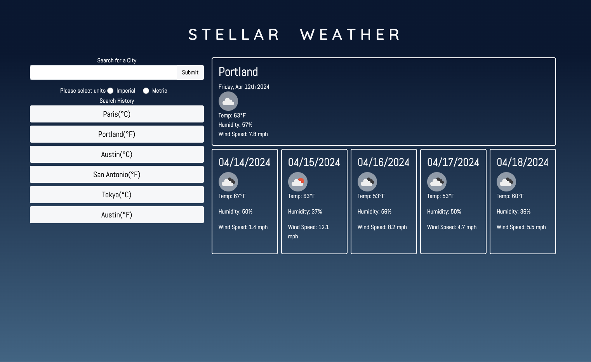
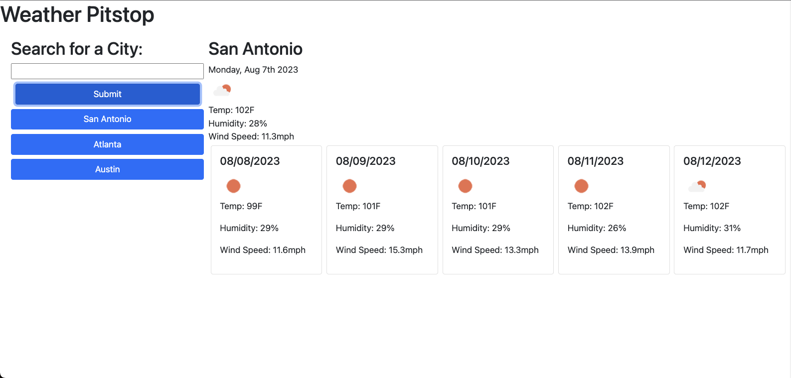

# Stellar Weather

## Description

This weather application displays the current forcast for a desired city as well as the future forcast over a 5 day period. This application can make it easier for those who are frequently traveling to view the current and future weather conditions for the cities they wish to travel to. The search history section also allows users to easily view cities they have recently searched and recheck the weather conditions of that city. This can aid in comparing weather conditions of searched cities when choosing where to travel.

This application required me to become familiar with API's and making fetch requests from them. It also allowed for extra practice traversing the fetched objects from the API library. I was also able to practice with some basic elements of Bootstrap styling, as there is no external CSS file in this web application. I challenged myself to use as much Bootstrap styling as possible (thinking I could get away without using any basic CSS), but there are a few things Bootstrap can't quite do on its own. In keeping with using as little basic CSS as possible I limited myself to internal CSS with no external CSS.

After some time I returned to this application and refactored much of it. I wanted to enhance the application's accessibility after learning more about web accessibility standards. I tested background colors and their contrast against the text and button colors so that they met [WCAG](https://www.w3.org/TR/WCAG21/#:~:text=Web%20Content%20Accessibility%20Guidelines%20(WCAG)%202.1%20defines%20how%20to%20make,%2C%20learning%2C%20and%20neurological%20disabilities.) standards with help from the [color contrast checker](https://www.audioeye.com/color-contrast-checker/?cc_gate=check&utm_adgroup=Color-Checker&utm_source=google&utm_medium=paidsearch&utm_campaign=Generic-Color-Contrast-Checker-97F&utm_term=color%20accessibility%20test&utm_content=colorcontrastchecker&hsa_acc=3628656526&hsa_cam=20762452258&hsa_grp=156873707433&hsa_ad=680111723422&hsa_src=g&hsa_tgt=kwd-443638824856&hsa_kw=color%20accessibility%20test&hsa_mt=e&hsa_net=adwords&hsa_ver=3&gad_source=1&gclid=CjwKCAjwzN-vBhAkEiwAYiO7oJ6kpi5F9EJIdlA_P7rQBpXN0B_jpinvPU8ruXTAx-0sMibEdRMwzBoCqgwQAvD_BwE) from [audioeye](https://www.audioeye.com/?_gl=1*1waa3dn*_up*MQ..&gclid=CjwKCAjwzN-vBhAkEiwAYiO7oJ6kpi5F9EJIdlA_P7rQBpXN0B_jpinvPU8ruXTAx-0sMibEdRMwzBoCqgwQAvD_BwE). I added backgrounds behind the weather icons so they would be more easily visible. The icons have a white and a dark color on them that made the background difficult to adjust to be accessible for both. I hope to continue to make this more accessible for all users.

Another way that I made the app a bit more accessible was to add the ability to select units (for temperature and wind speed). This way the application is not so imperial-units-centric and easy to use by people who prefer or only know metric units. I am very thankful that a friend, who uses metric units, brought this to my attention. 

I also have checked that users are able to use the keyboard to navigate through the application. One issue here is that once a user has tabbed to the search history buttons, they navigate through them from the bottom up, as I have them organized in descending order so that the most recent search is at the top. I hope to find a way around this in the future. I also plan on editing the form so that screen readers will have an easier time accessing and reading it. As it now stands it could be confusing that a user would tab past the submit button before selecting their desired units. 

This is an example of background colors and button colors that do not meet accessibility standards.

Here is the application in its current state with more accessibile background colors, backgrounds for the icons and button colors that meet WCAG standards regarding contrast to the background.

## Installation

To run the code, clone the project directories from [my repository](https://github.com/sillytsundere/my-weather-spot) and open the index.html and script.js files in preferred code editor. The HTML file can be viewed to examine the basic display elements and how they are organized on the webpage. Styling elements from bootstrap can also be seen in the HTML file. The Javascript file can be viewed to inspect the interactivity of the webpage as well as dynamically created elements.

## Usage

To use this app, once on the homepage a user will type a desired city into the search bar. Upon clicking "Submit" the current weather conditions for that city will be displayed to the right. A button will appear below the search form for that recently searched city. Further searched cities will be listed under the search form as buttons, with the most recent at the top so users can click a recently searched city to view the weather conditions for that city again.

The City information listed includes the date, a weather icon depicting the current weather conditions, temperature, wind speed and humidity. These pieces of information are also listed in the 5 day forcast section which describes weather conditions for the next 5 days. If the user has visited the site previously, their previous city searches will populate underneath the search form, pulled from local storage.

The deployed site can be reached at this link: https://sillytsundere.github.io/my-weather-spot/

## Support

Reach out to me if you have any questions at:

[My Github page](https://github.com/sillytsundere)

## Credits

This application uses the [Open Weather API](https://openweathermap.org/api).

## Badges

## License

MIT License
